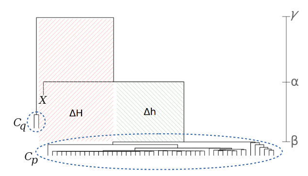

# Hierarchical Clustering Transition Index (hcti) - v1.0

### Thanks for your interest in using hcti.

This software was initially presented in the manuscript "Country Transition Index Based on Hierarchical Clustering to Predict Next COVID-19 Waves" (submitted to Scientific Report -- under review)

### About the manuscript findings

COVID-19 has widely spread around the world, impacting the health systems of several countries in addition to the collateral damage that societies will face in the next years. 

From the COVID-19 dataset by the Johns Hopkins University Center for Systems Science and Engineering, we present a temporal analysis on the number of new cases and deaths among countries using artificial intelligence. Our approach incrementally models the cases using a hierarchical clustering that emphasizes country transitions between infection groups over time.

<p align="center">
  
</p>

### About the transition index

The transition index is suitable for any dataset and is applied on dendogram produced by hierachical clustering. In summary, it is used to extract information from dendrogram clades. When used along with multiple clustering execution (e.g. temporal data), it allows to track element movements among clusters.

<p align="center">
  
</p>

The organization of the material is:

> - **/data** - contains the datasets to reproduce our findings and create the figures.
> - **/R** - contains the source code for the machine learning framework and for other analyses.

To reproduce all experiments using individual ML classification models on the training dataset, please run the source codes:

```Prolog
Rscript R/tree-clustering.R 
```

You can also open R and run:

```Prolog
source("R/tree-clustering.R")
```

Running the code "R/tree-clustering.R" you can see a complete example of our experiments.

If you find any issues with the code, please contact me: ricardoar@ufba.br

On the behalf of all of the authors, we appreciate your interest in our software and hope it is useful to your research.
